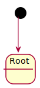
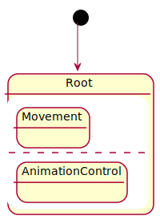
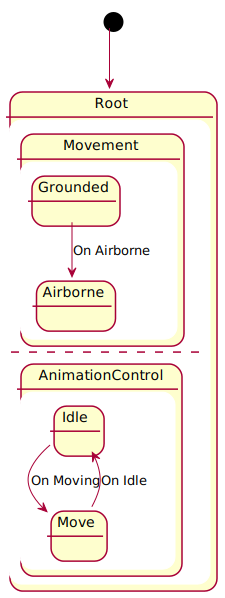
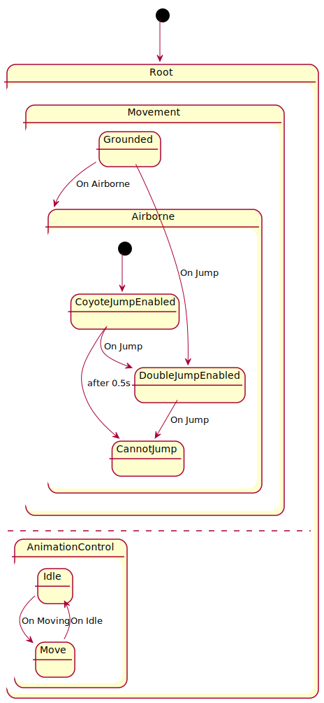

# plantuml-zoom-example

## Files
atomic states: `[stateName].puml`  
non-atomic states: `[stateName].[level].puml`
```
.
├── Airborne.0.puml
├── Airborne.1.puml
├── AnimationControl.0.puml
├── AnimationControl.1.puml
├── CannotJump.puml
├── CoyoteJumpEnabled.puml
├── DoubleJumpEnabled.puml
├── Grounded.puml
├── Idle.puml
├── Movement.0.puml
├── Movement.1.puml
├── Movement.2.puml
└── Move.puml
```


## General approach
1. non-atomic states `[stateName].n.puml` includes `[subState].[n-1].puml` if available. Otherwise include highest available, for example: `!include AnimationControl.1.puml` in  `root.3`
2. no `!includes` in `[stateName].0` 
3. arrows into a substate only allowed when non-atomic state at least level2, see example   `Grounded --> DoubleJumpEnabled: On Jump` in `Movement.2.puml`


## Level 0
```
@startuml root
[*] --> Root
state Root 
@enduml
```



## Level 1
```
@startuml root
[*] --> Root

state Root {
    !include Movement.0.puml
    ---
    !include AnimationControl.0.puml
}
@enduml
```


## Level 2
```
@startuml root
[*] --> Root

state Root {
    !include Movement.1.puml
    ---
    !include AnimationControl.1.puml
}
@enduml
```


## Level 3
```
@startuml root
[*] --> Root

state Root {
    !include Movement.2.puml
    ---
    !include AnimationControl.1.puml
}
@enduml
```



## SVG creation
```
plantuml -tsvg -i root.0.puml -o root.0
plantuml -tsvg -i root.1.puml -o root.1
plantuml -tsvg -i root.1.puml -o root.1
plantuml -tsvg -i root.1.puml -o root.1
```